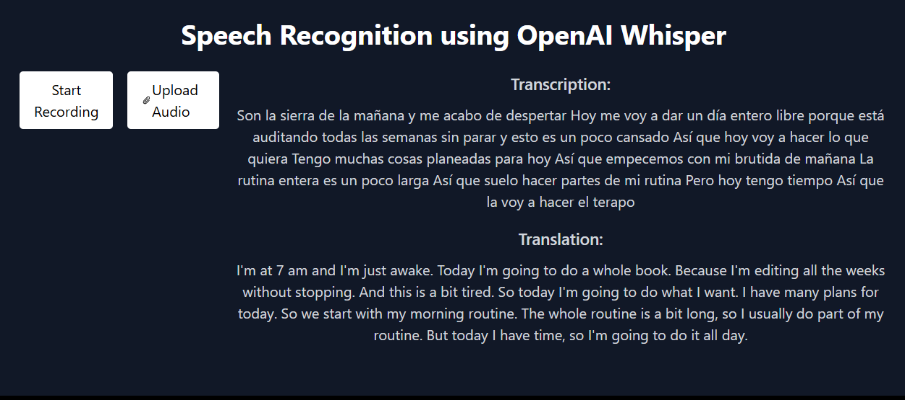

# OpenAI Whisper Web App

Built a web app to run a state-of-the-art speech recognition model, and used it to transcribe and translate my voice; using OpenAI Whisper, Python Flask, HTML, Tailwind CSS, and JavaScript.

# screenshot here


## Features

- High accuracy speech-to-text conversion
- Supports multiple languages
- Easy to integrate with various applications

## Usage

```bash
pip install -r requirements.txt
python3 app.py
```

## OpenAI Whisper's Training

OpenAI Whisper was trained on 680,000 hours of data. This is significantly more than the average human's waking hours in a lifetime, which is estimated to be around 467,000 hours. This massive amount of training data is likely a major factor in the model's impressive performance.

For humans, <br>
- 80 years old: This is the total number of years being considered.
- 365 days/year: This is the average number of days in a year.
- 16 hours/day: This is the average number of hours per day that a person is awake.
- 80 years * 365 days/year * 16 hours/day = 467,200 hours
